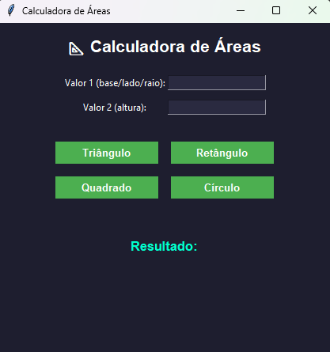

# 📐 Calculadora de Áreas (Python + Tkinter)

Aplicação desktop desenvolvida em Python utilizando Tkinter para cálculo de áreas de figuras geométricas.

## 🚀 Demonstração
Aplicação com interface gráfica moderna para cálculo rápido de áreas.

## 📸 Interface

## 🧮 Funcionalidades
- Área do Triângulo
- Área do Retângulo
- Área do Quadrado
- Área do Círculo

## 🛠️ Tecnologias utilizadas
- Python
- Tkinter

## 📦 Estrutura do Projeto
